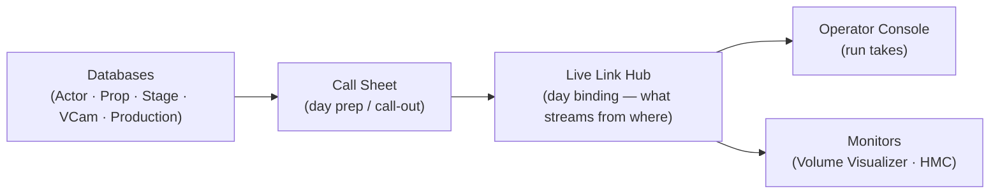

# PCAP Pipeline

A performance-capture session-management pipeline for **Unreal Engine 5.8**, built for a solo operator (or small team) running a mocap volume end to end: **prep the day → run the takes → watch the floor.**

The heart of the project is the **PCAPTool** editor plugin — a workflow-organized toolset on top of one shared data model — plus **LiveLinkViconDataStream** for getting Vicon data into the engine. On 5.8, PCAPTool's data model drives Epic's official **Performance Capture Core** plugin: the databases are the source of truth and a bridge spawns/configures the engine's `ACapturePerformer` actors from the called shot. (The prop bridge and Mocap Manager UI live in the separate Performance Capture **Workflow** plugin — wired in behind `WITH_PCAP_WORKFLOW` when that plugin is installed.)

---

## The toolset

Tools register under **Window ▸ Tools** in two groups — **PCAP Tools** (operator tools) and **Databases** (the libraries).

| Tool | Group | What it does |
|---|---|---|
| **Call Sheet** | PCAP Tools | Single-page day prep — pick production / day / stage, call out actors · props · vcam, build the shot list (CSV import/export) |
| **Operator Console** | PCAP Tools | Navigate the day's shots and run takes (Take Recorder backend) |
| **HMC Monitor** | PCAP Tools | Per-camera head-mounted-camera health checks |
| **VCam Operator** | PCAP Tools | Virtual camera control (a WVCAM replacement) |
| **Actor / Prop / Stage / VCam / Production Database** | Databases | Permanent card libraries — everything ever created |
| **Volume Visualizer** | *placeable actor* | Vicon markers as dots + labels, to scale inside the stage FBX |

## Architecture — the spine

Libraries hold the data, the Call Sheet preps the day from them, Live Link binds the called-out items to their live sources at runtime, and purpose-built monitors watch the floor.

**Principles:** databases are pure libraries (no Live Link) that expose shared Slate widgets; the Call Sheet *composes* those widgets rather than re-implementing them; monitoring is distributed into small purpose-built surfaces, not one mega-panel. All tool assets live under one content root, `/Game/PCAPTool/` (see `PCAPToolPaths.h`).

## Plugins

| Plugin | Purpose |
|---|---|
| [`PCAPTool`](Plugins/PCAPTool) | The toolset + data model. Editor module; drops into any UE5 project. |
| `LiveLinkViconDataStream` | Vicon DataStream → Live Link, and the bundled Vicon DataStream SDK that the Volume Visualizer uses for the raw marker cloud. |
| `Performance Capture Core` *(engine)* | Epic's official performer actors. PCAPTool builds on its data model — `UPCAPMocapBridge` maps called actors onto `ACapturePerformer`. The prop bridge (`UPCapPropComponent`) and Mocap Manager UI come from the optional Performance Capture **Workflow** plugin (`WITH_PCAP_WORKFLOW`). |

## Build & run

- **Engine:** Unreal Engine **5.8**. The project builds on **Windows** (MSVC). Enable the **Performance Capture Core** plugin (ships with the engine) — PCAPTool depends on its `PerformanceCaptureCore` module. The prop bridge additionally needs the **Performance Capture Workflow** plugin; it's compiled out (`WITH_PCAP_WORKFLOW=0`) until that's installed.
- Right-click `PCAPPipeline.uproject` → **Generate Visual Studio project files**, then build **Development Editor / Win64** (or open the `.uproject` and let it compile the modules).
- After a successful build, **restart the editor** — the tool tabs register at module startup — and find them under **Window ▸ Tools**.

## Repository layout

| Path | What |
|---|---|
| `PCAPPipeline.uproject` | The UE project |
| `Source/` | Project-level game module |
| `Plugins/PCAPTool/` | The PCAP toolset plugin ([README](Plugins/PCAPTool/README.md)) |
| `Plugins/LiveLinkViconDataStream/` | Vicon DataStream Live Link + SDK |
| `Config/` | Project config (`.ini`) |
| `Content/` | UE content (assets live under `Content/PCAPTool/`) |
| `docs/` | Design specs, plans, per-tool how-tos ([index](docs/README.md)) |
| `CONTRIBUTING.md` | Build steps + git workflow + repo conventions |

## Documentation

Design specs, implementation plans, and per-tool how-tos live in [`docs/`](docs/README.md) — start at the index. Each substantial feature is brainstormed into a dated `*-design.md` spec before it's built. See [CONTRIBUTING](CONTRIBUTING.md) for how the repo is worked: build steps, the Mac-authors / Windows-builds split, and the git guardrails.

## License

**To be determined.** No open-source license has been chosen yet, so the code is currently all-rights-reserved by default. Bundled third-party components keep their own terms — notably **Unreal Engine** (governed by the [Unreal Engine EULA](https://www.unrealengine.com/eula)) and the **Vicon DataStream SDK** (Vicon's own license). If this repository is or becomes public, the vendored Vicon SDK binary and Vicon sample content should be reviewed against Vicon's redistribution terms before relying on any project-wide license.
